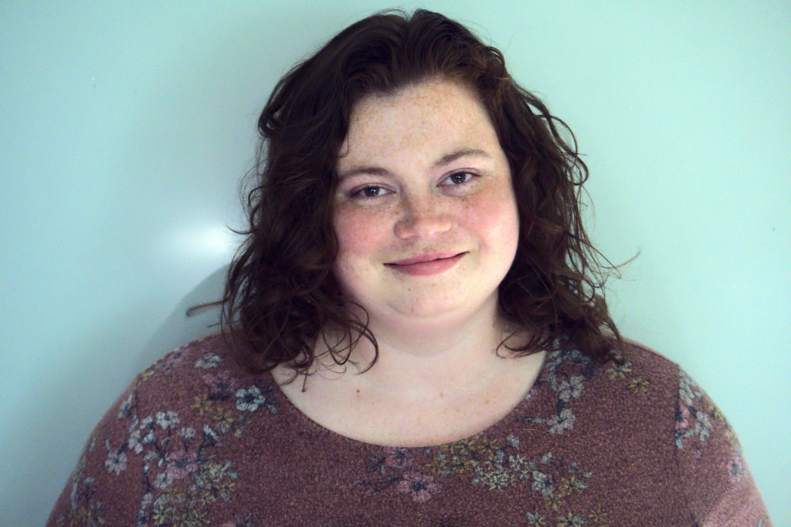

# Our Team
## Megan Peters, MACP, CT

Hi everyone! I am Megan and the Peters half of MacLeod and Peters Counselling. I am also currently accepting new clients. I offer counselling for clients with ADHD, OCD, anxiety, trauma, self-esteem/self-confidence, and mood disorders.  I work with clients age 10+.  You can contact me at meganpeterscounselling@gmail.com to get some more information!

## Rachel Macleod, MACP

Hi all! I'm Rachel, the MacLeod of MacLeod and Peters Counselling. I am currently taking new clients and I offer counselling for couples, LGBTQ2SIA+ adults and youth, adults with autism, trauma, self-esteem/self-confidence, and mood disorders. Please contact me at rmacleodcounselling@gmail.com to get more information!

